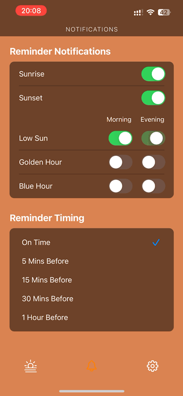
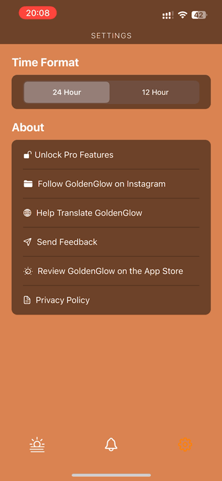

# GoldenGlow
## Golden Hour Alarm & Photography Guide - iOS app
"Don't miss out on the breathtaking beauty of the golden hour, no matter where you are."

- What is [Golden Hour](https://en.wikipedia.org/wiki/Golden_hour_(photography))?

## Description
This app notifies you when Golden Hour starts and ends at your location. It is the perfect time to take photos or videos of people, objects, or scenery. It enhances your images with beautiful color grading. With this app, you can enjoy the golden hour and get a break from your busy life.

- Change Location and Date
  - You can easily adjust your location and date to plan your trips. It calculates the golden hour timetable based on your location and date.

- Weather Info
  - It shows the weather only for the golden hour and predicts the quality of the golden light. You can skip the notification when it's cloudy.

- Reminder Option
  - You can choose from 5 different notification times (On Time, 5 minutes before, 15 minutes before, 30 minutes before, 1 hour before) to suit your schedule.

- Duration
  - It provides how long each phase will last with solar altitude angles within the golden hour.

- Design
  - Inspired by the mesmerizing colors of the sky, the app's design aims to reflect the beauty of nature's palette.
 
## Skillset

- UIKit, Swift5
- MVC Design Pattern
- Core Data, Core Location
- UserDefault
- Realm (local DB)
- CocoaPods and 3rd party libraries
- In-App Purchase & Apple StoreKit
- Git Version Control on Xcode 
- Sketch5 (Design Tool)

## What I've Learned from this project
This project has greatly enhanced my iOS development skills. It also combines Astronomy, Geography, Mathematics, and Algorithms.

- Programming Language: Strengthened my Swift 5 skills, enabling me to implement desired features more efficiently.
- Architecture: Applied the MVC design pattern to structure the app's design and scenarios effectively.
- App Lifecycle: Developed a deep understanding of the iOS lifecycle, effectively managing resources throughout the app's lifecycle.
- UIKit: Gained proficiency in quickly selecting and implementing appropriate UI components.
- Realm: Learned local database management using Realm, enhancing data storage and retrieval capabilities.
- UI/UX: Improved UI/UX design skills, ensuring a more intuitive and engaging user experience.
- Algorithm: Applied NREL's Solar Position Algorithm (SPA) and Adaptive Step Size Algorithm.

## DEMO
.              |.|.  
:-------------------------:|:-------------------------:|:-------------------------:
  |   |  
  |  |

## About Golden Hour

